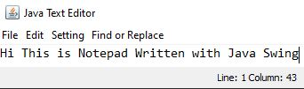
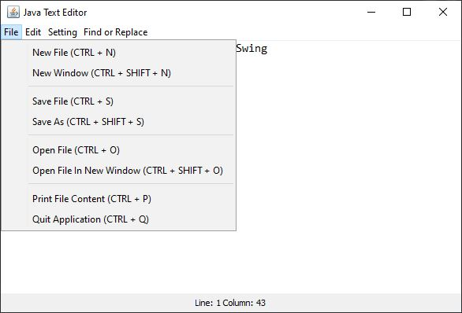

## This is basic Notepad of mine, written in Java for fun

#### It is Notepad, You can change the font size, cut, copy, paste and do all activities that a normal NotePad can do

## Interface of Text Editor

## Diagrams below show its features as a text editor

## File Menu

## Edit Menu

## Setting Menu

## Find Replace Menu

